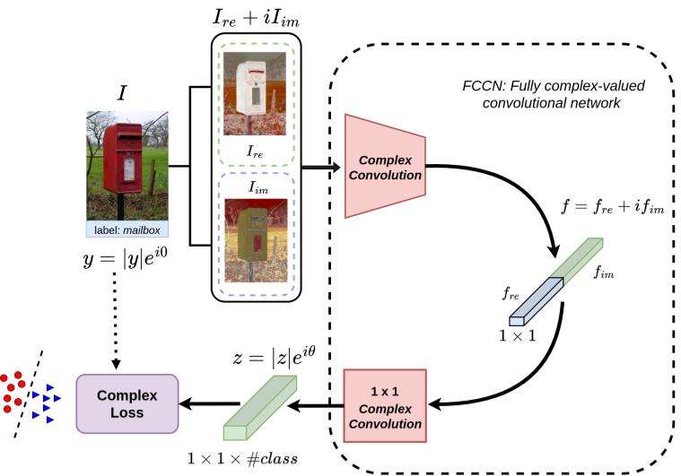

# FCCNs: Fully Complex-valued Convolutional Networks using Complex-valued Color Model and Loss Function


we propose a complex-valued color model and loss function and turn fully-connected layers into convolutional layers. All these contributions culminate in what we call FCCNs (Fully Complex-valued Convolutional Networks), which take complex-valued images as inputs, perform only complex-valued operations, and have a complex-valued loss function.

This repo contains code for the paper "[FCCNs: Fully Complex-valued Convolutional Networks usnig Complex-valued Color Model and Loss Function](https://openaccess.thecvf.com/content/ICCV2023/papers/Yadav_FCCNs_Fully_Complex-valued_Convolutional_Networks_using_Complex-valued_Color_Model_and_ICCV_2023_paper.pdf)".



```latex
@InProceedings{Yadav_2023_ICCV,
    author    = {Yadav, Saurabh and Jerripothula, Koteswar Rao},
    title     = {FCCNs: Fully Complex-valued Convolutional Networks using Complex-valued Color Model and Loss Function},
    booktitle = {Proceedings of the IEEE/CVF International Conference on Computer Vision (ICCV)},
    month     = {October},
    year      = {2023},
    pages     = {10689-10698}
}
```
